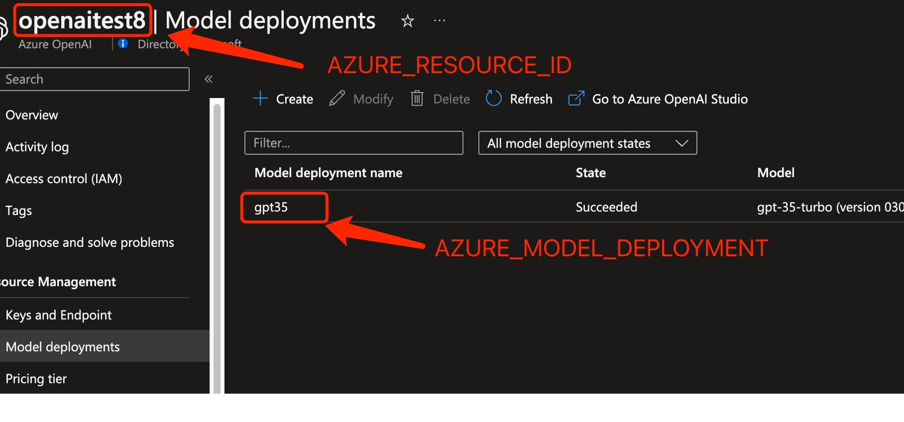

# Azure OpenAI Proxy

[English](./README.en-US.md) | 简体中文

一个 Azure OpenAI API 代理工具，能将 OpenAI API 请求转换为 Azure OpenAI API 请求，使仅支持 OpenAI 的应用程序可以无缝地使用 Azure Open AI。

## 使用要求

必须拥有Azure OpenAI帐户才能使用 Azure OpenAI Proxy。

## Docker部署
`docker run -d -p 3080:3080 scalaone/azure-openai-proxy`

## 本地运行和测试，命令行方式

1. 安装 NodeJS 18。
2. 克隆代码到命令行窗口。
3. 运行 `npm install` 安装依赖项。
4. 运行 `npm start` 启动应用程序。
5. 运行下面脚本测试，运行前需要把`YOUR_RESOURCE_ID`，`YOUR_MODEL_DEPLOYMENT`，`YOUR_API_KEY`替换。
```bash
curl -X "POST" "http://localhost:3000/v1/chat/completions" \
-H 'Authorization: YOUR_RESOURCE_ID:YOUR_MODEL_DEPLOYMENT:YOUR_API_KEY' \
-H 'Content-Type: application/json; charset=utf-8' \
-d $'{
  "messages": [
    {
      "role": "system",
      "content": "You are an AI assistant that helps people find information."
    },
    {
      "role": "user",
      "content": "hi."
    }
  ],
  "temperature": 1,
  "model": "gpt-3.5-turbo",
  "stream": false
}'
```

## 本地运行和测试，使用WebChat测试streaming

1. 克隆代码到命令行窗口
2. 更新 `docker-compose.yml` 文件中第九行的 `OPENAI_API_KEY` 环境变量，YOUR_RESOURCE_ID:gpt-35-turbo|YOUR_MODEL_DEPLOYMENT,gpt-4|YOUR_MODEL_DEPLOYMENT:YOUR_API_KEY
3. 执行构建：运行 `docker-compose build`
4. 启动服务：运行 `docker-compose up -d`
5. 运行`http://localhost:3000`

常见问题

Q：什么是`YOUR_RESOURCE_ID`，`YOUR_MODEL_DEPLOYMENT`，`YOUR_API_KEY`

A: 可以在Azure的管理门户里查找，具体见下图标注



Q: 如何支持GPT-4

A: 要使用GPT-4，请使用下列格式的key: 

`YOUR_RESOURCE_ID:gpt-3.5-turbo|YOUR_MODEL_DEPLOYMENT,gpt-4|YOUR_MODEL_DEPLOYMENT,gpt-4-32k|YOUR_MODEL_DEPLOYMENT:YOUR_API_KEY`

# 贡献代码方式

欢迎提交各种PR。

# 免责声明

此代码仅供演示和测试目的。